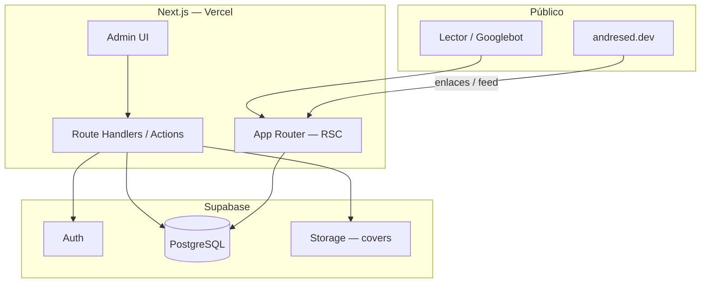

# Arquitectura — Overview

## Stack propuesto

| Capa | Tecnología | Rol |
|------|------------|-----|
| Framework | **Next.js 15** (App Router) | UI pública + admin + Route Handlers / Server Actions |
| Lenguaje | **TypeScript** strict | Tipos end-to-end |
| Estilos | **Tailwind CSS 4** | Alineado a tokens de andresed.dev |
| BD + Auth | **Supabase** | PostgreSQL, Auth, Storage, RLS |
| Markdown | `react-markdown` + `remark-gfm` + `rehype-*` | Render seguro |
| Syntax highlight | `shiki` o `rehype-pretty-code` | Bloques de código |
| Validación | **Zod** | DTOs en server actions |
| SEO | `next/metadata`, `next-sitemap` o manual | Sitemap, robots, JSON-LD |
| Deploy | **Vercel** + Supabase cloud | Preview por PR |

## Diagrama de contexto



## Estructura de carpetas (objetivo)

```
makingcode/
├── app/
│   ├── (public)/
│   │   ├── page.tsx                 # Home — últimos posts
│   │   ├── blog/
│   │   │   ├── page.tsx             # Listado
│   │   │   └── [slug]/page.tsx      # Post
│   │   ├── tags/[tag]/page.tsx
│   │   └── about/page.tsx
│   ├── (admin)/
│   │   ├── login/page.tsx
│   │   └── dashboard/
│   │       ├── page.tsx
│   │       ├── posts/new/page.tsx
│   │       └── posts/[id]/edit/page.tsx
│   ├── api/
│   │   ├── feed/route.ts            # RSS
│   │   └── revalidate/route.ts      # On-demand ISR
│   ├── sitemap.ts
│   └── robots.ts
├── components/
├── lib/
│   ├── supabase/                    # client, server, middleware
│   ├── posts/                       # queries, mappers
│   └── seo/                         # metadata helpers
├── supabase/
│   └── migrations/
└── docs/
```

## Capas lógicas

| Capa | Ubicación | Regla |
|------|-----------|-------|
| UI | `app/`, `components/` | Sin queries directas a Supabase en Client Components sensibles |
| Application | `lib/posts/`, server actions | Orquestación, validación Zod |
| Domain | tipos en `lib/posts/types.ts` | Estados `draft` \| `published`, reglas de slug |
| Infra | `lib/supabase/` | Clientes server/browser, RLS |

## Renderizado y cache

| Ruta | Estrategia | Motivo |
|------|------------|--------|
| `/`, `/blog` | ISR `revalidate: 3600` + on-demand al publicar | SEO + frescura |
| `/blog/[slug]` | ISR + `generateStaticParams` para publicados | URLs estables, CWV |
| Admin | `dynamic = 'force-dynamic'` | Siempre autenticado |
| Feed RSS | `revalidate: 3600` | Agregadores |

## Seguridad (resumen)

- **Anon key** en cliente solo para lectura pública vía vistas/RLS.
- **Service role** solo en server (actions, webhooks).
- Middleware valida sesión en `/(admin)/*`.
- Markdown sanitizado (`rehype-sanitize`); sin HTML crudo arbitrario en v1.
- Rate limit en login y revalidate webhook.

## Variables de entorno

```bash
NEXT_PUBLIC_SUPABASE_URL=
NEXT_PUBLIC_SUPABASE_ANON_KEY=
SUPABASE_SERVICE_ROLE_KEY=      # solo server
NEXT_PUBLIC_SITE_URL=https://www.makingcode.dev
REVALIDATE_SECRET=              # webhook ISR
```

Ver `.env.example` (se creará en fase de scaffold).
