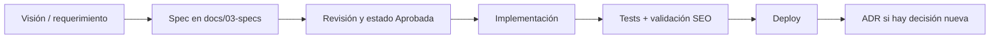

# Documentación — Making Code

Índice maestro del proyecto. Cada cambio de producto debe actualizar la spec correspondiente **antes** del código.

## Flujo spec-driven

## Estados de una spec

| Estado | Significado |
|--------|-------------|
| **Borrador** | En redacción, no implementar |
| **Revisada** | Lista para tu OK |
| **Aprobada** | Puede implementarse |
| **Alineada** | Código y spec coinciden (post-merge) |

## Índice

| # | Documento | Descripción |
|---|-----------|-------------|
| 0 | [Visión y recapitulación](./00-vision/recapitulacion.md) | Por qué reconstruir, qué conservar |
| 0 | [Objetivos y métricas](./00-vision/objetivos.md) | Éxito del proyecto |
| 1 | [Arquitectura](./01-arquitectura/overview.md) | Stack Next.js + Supabase |
| 1 | [ADR-001 Monolito Next.js](./01-arquitectura/adr/001-monolito-nextjs.md) | Backend interno en App Router |
| 2 | [Requerimientos](./02-requerimientos/README.md) | Épicas e historias |
| 3 | [Spec — Blog / Posts](./03-specs/blog/spec.md) | Publicación, slugs, markdown |
| 3 | [Spec — Auth](./03-specs/auth/spec.md) | Login admin, sesiones |
| 3 | [Spec — SEO](./03-specs/seo/spec.md) | Metadata, sitemap, rendimiento |
| 4 | [Design system](./04-diseno/design-system.md) | UI alineada a andresed.dev |
| 5 | [Migración legado](./05-migracion/README.md) | 17 posts históricos |
| 6 | [Roadmap por fases](./06-roadmap/phases.md) | Orden de entrega |

## Convenciones

- Specs en `docs/03-specs/<contexto>/spec.md`.
- Decisiones irreversibles → `docs/01-arquitectura/adr/NNN-titulo.md`.
- Nombres de archivo en kebab-case; contenido en español (UI del blog puede ser EN/ES más adelante).

## Plantilla de spec

Ver [_plantilla/spec.md](./_plantilla/spec.md).
